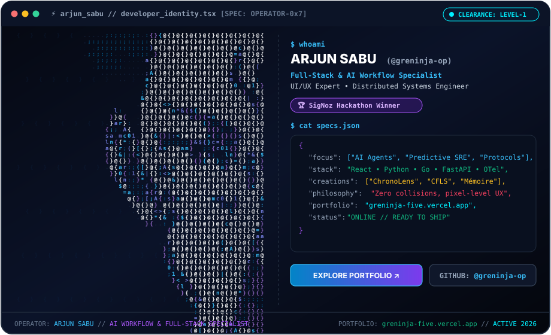
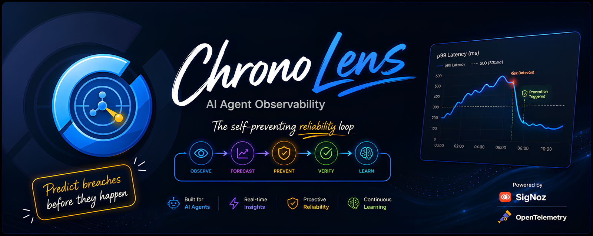
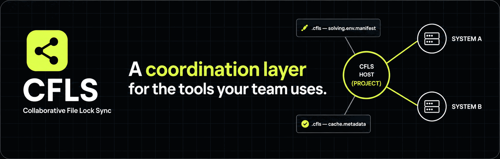

<div align="center">

<!-- UNIFIED TERMINAL DEVELOPER ID CARD & NEURAL CODE PORTRAIT -->
<a href="https://greninja-five.vercel.app" target="_blank">
  
</a>

<br/><br/>

[](https://greninja-five.vercel.app)
[](https://github.com/greninja-op/ChronoLens)
[](https://github.com/greninja-op)
[](mailto:sabuarjun88@gmail.com)

</div>

---

### 🧬 Full-Stack & AI Workflow Integration Specialist

> *"Engineering high-velocity agent architectures, real-time distributed consensus, and pixel-level UX."*

I build production-grade systems across autonomous agent workflows, distributed synchronization protocols, and closed-loop telemetry control planes.

---

## 📂 FEATURED PROJECTS

### ⚡ [ChronoLens](https://github.com/greninja-op/ChronoLens) `🏆 SigNoz Hackathon Winner`

<p align="center">
  <a href="https://github.com/greninja-op/ChronoLens">
    
  </a>
</p>

A closed-loop predictive SRE control plane built on **SigNoz OpenTelemetry** feeds. It monitors live telemetry traces, forecasts SLO breaches and AI agent cost spirals before impact, triggers reversible circuit breakers, and verifies the outage never happened.

- **Stack:** Python · OpenTelemetry · SigNoz API · FastAPI · React · Docker
- **Repository:** [`greninja-op/ChronoLens`](https://github.com/greninja-op/ChronoLens)

<br/>

### 🔒 [CFLS (Collaborative File Lock Sync)](https://github.com/greninja-op/CFLS-Collaborative-File-Lock-Sync)

<p align="center">
  <a href="https://github.com/greninja-op/CFLS-Collaborative-File-Lock-Sync">
    
  </a>
</p>

Real-time distributed file locking and coordination protocol for developers and autonomous AI coding agents in Git repositories. Prevents merge collisions before code touches disk via atomic heartbeat leases and sub-millisecond delta streaming over gRPC & WebSockets.

- **Stack:** Go · gRPC · WebSockets · Distributed Consensus · TypeScript CLI
- **Repository:** [`greninja-op/CFLS-Collaborative-File-Lock-Sync`](https://github.com/greninja-op/CFLS-Collaborative-File-Lock-Sync)

<br/>

### 🧠 [Mémoire](https://github.com/greninja-op/Memoire)

<p align="center">
  <a href="https://github.com/greninja-op/Memoire">
    
  </a>
</p>

A shared brain for the whole family built into WhatsApp. Turns messages, voice notes, and calls into organized, gently-reminded tasks in 27 languages with zero app installation. Powered by a dual-tier LLM architecture and voice calling bridges.

- **Stack:** Bun · Hono · TypeScript · Drizzle · PostgreSQL · FastAPI · WebRTC · OpenAI · Sarvam
- **Repository:** [`greninja-op/Memoire`](https://github.com/greninja-op/Memoire)

<br/>

### 🏦 [Nuvault](https://github.com/greninja-op/Nuvault)

A full-stack personal finance platform that unifies your financial life into one secure space, layering an AI advisor that reads your verified numbers before answering.

- **Stack:** React 18 · Vite · Node.js · Express · MongoDB · Gemini AI
- **Repository:** [`greninja-op/Nuvault`](https://github.com/greninja-op/Nuvault)

---

## 📊 GITHUB ACTIVITY & TELEMETRY

<div align="center">
  <table border="0">
    <tr>
      <td align="center" width="50%">
        
      </td>
      <td align="center" width="50%">
        
      </td>
    </tr>
  </table>
</div>

---

## 🛠️ TECHNICAL ARSENAL

| Domain | Technologies |
| :--- | :--- |
| **🤖 AI & Autonomous Agents** | OpenTelemetry · SigNoz API · FastAPI · Python · Prompt Guardrails · Sarvam · ElevenLabs |
| **⚡ Distributed Systems & Backend** | Go · gRPC · WebSockets · Node.js · Bun · PostgreSQL · MongoDB · Drizzle ORM |
| **🎨 Frontend & UI/UX Design** | React · Vite · TypeScript · Tailwind CSS · Glassmorphism · Figma Design Systems |
| **🚢 DevOps & Reliability** | Docker · Docker Compose · Linux Worktrees · Git Worktrees · CI/CD Actions · PowerShell |

---

<div align="center">

### 🌐 CONNECT & COLLABORATE

<br/>

<a href="https://greninja-five.vercel.app" target="_blank">
  
</a>
&nbsp;&nbsp;
<a href="https://github.com/greninja-op" target="_blank">
  
</a>
&nbsp;&nbsp;
<a href="mailto:sabuarjun88@gmail.com">
  
</a>

<br/><br/>

```
STATUS: ONLINE // OPERATOR: 0x7-GRENINJA // "Zero collisions, pixel-level UX."
```

</div>
