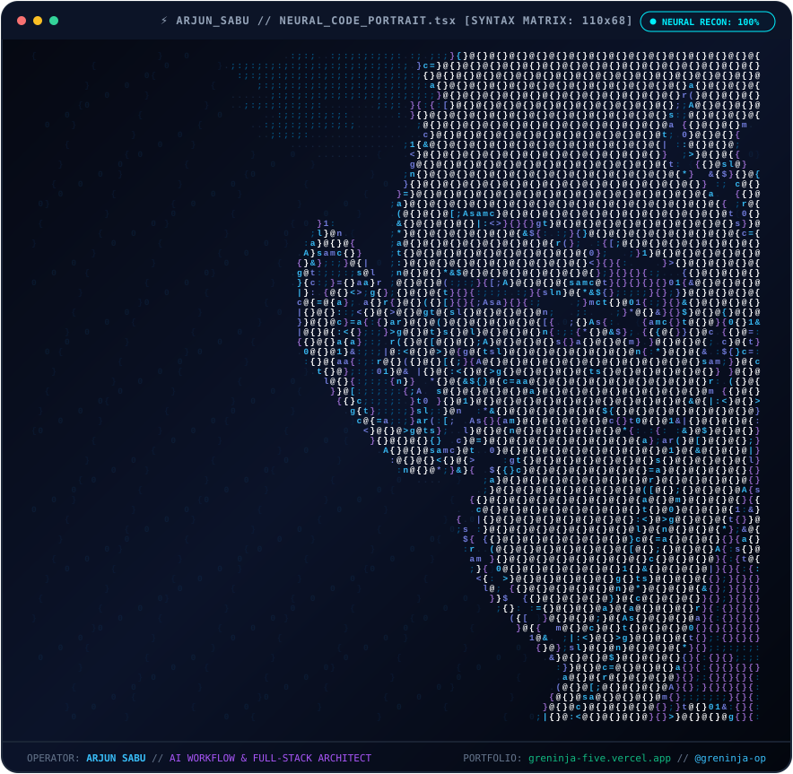
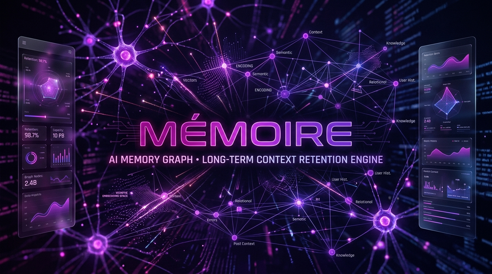
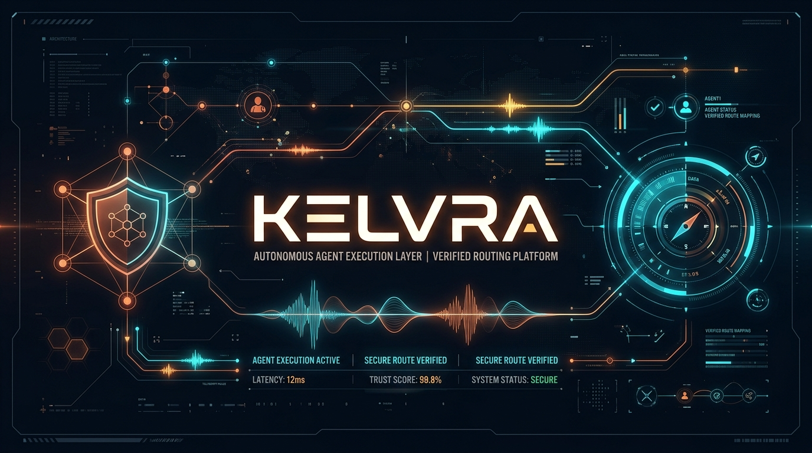

<div align="center">

<!-- DEVELOPER IDENTITY CARD -->
<a href="https://greninja-five.vercel.app" target="_blank">
  
</a>

<br/><br/>

[](https://greninja-five.vercel.app)
[](https://github.com/greninja-op/ChronoLens)
[](https://github.com/greninja-op)
[](mailto:sabuarjun88@gmail.com)

</div>

<br/>

---

### 🧬 Architecting High-Velocity AI Workflows & Distributed Consensus

> *"Bridging mathematical precision, autonomous agent orchestration, and pixel-level UX engineering."*

I am **Arjun Sabu** (`@greninja-op`), a **Full-Stack Developer & AI Workflow Integration Specialist** and **UI/UX Expert**. I architect production-grade software across distributed consensus, agentic context memory, real-time developer coordination, and closed-loop site reliability telemetry.

- 🧠 **Autonomous Agent Infrastructure:** Designing long-term episodic memory graphs and runtime prompt security guardrails for production LLMs.
- ⚡ **Distributed Systems:** Engineering real-time file-locking protocols preventing workspace state collisions across multi-user developer worktrees.
- 🎨 **UI/UX & Design Soul:** Translating complex distributed telemetry and agent architectures into sleek, responsive, and glassmorphic user interfaces.
- 🏆 **Hackathon Proven:** Winner of the **Agents of SigNoz Hackathon** for architecting self-healing predictive SRE control planes.

---

<br/>

<div align="center">
  <h2>⚡ NEURAL CODE PORTRAIT // TYPOGRAPHIC SYNTAX MATRIX</h2>
  <p><i>A dual-nature projection: from a distance, facial contours emerge; up close, every contour is forged from code tokens, functions, and curly braces.</i></p>

  
</div>

<br/>

<details>
<summary><b>👁️ [CLICK TO EXPAND] Raw Neural Syntax Stream (Plaintext Matrix &amp; Curly Braces)</b></summary>

```typescript
/* =========================================================================
 * ARJUN SABU // NEURAL SYNTAX PROJECTION MATRIX [88 COLS x 48 ROWS]
 * COMPILED WITH ACTIVE CONTEXT NODES, REVERSIBLE LOCKS & AGENTIC TRAJECTORIES
 * ========================================================================= */
```

<pre>
                                            _m@@$@BBB@$$$$$$$$$@BB@@@$$$$$$$$$$@@@$$dl X$B
                                   .'       +a$@$@%Wohdpqpdk*W%$$$$$$@@B@@@$$$$$$$@B$@xiW$
                                  :U#J_     +k$@$$$$$$B8#ap0Yn)tnUZh&$$$$$$@B@@$$$$$@$$C0@
                                 ~Q$$$$X' . <h$@$$@@@@$$$$$$$$%*qUn(})xUm*B$$$$$@$$$$@@$#%
                                ,X%mtr0$b_  io$@$$$$$$$$@@BBBB$$$$$$on1!++i{nQaB$$$$$$$@$$
                                l*Z}I!!f*8] i*$@@@MwqaW%$$$$$$$B888%%Zjfjf(]i_!}Y&$@$$$$@$
                                l#0!]0MWYJ%(lM$@$$%n?[]})fuYQqa#W8Wohom)[]{1fjjL0O%@@@$$@$
                                !#MJ*Bm)Iz$#j#$@#8$Q1nvvnrf)}{]>_I1(xUZppwCu(]})o$@$$$$$$$
                                i*$$$&n]Zbm%p#$$*b8%mM$$$$$$@B&c- <vv?<i[)zdk0j]0@@$kCW%8$
                                +h@B@&08L?ljho$$B**M$##B$$$$$$$Z}l1Ch%hQxI`[q##zQ$$#[(&%bv
                                `m$B$*ho}{I_wk&@@*#8dW8hh&$$$@@@hQJO#$$$$MLIfW$@W@Bu;U&%q[
                                 >o$@a0X[l(h$hm$$Bh&Zr0odk8%B@B@$$$$$$$$$$$bJW@$$$&cx(XMkU
                                  ;0$$m1{I)wM$u[p$$*odb**ho&%@%&&%B&M**M#M%$$$$$$B8$L~Q$$$
                                    (W$O[{]l]nO1,}W$B@@&**M#*h&$%&8B@B8888%B@@$@B#8a>?M@@%
                                     -O$Z?l]]IlOC`L$BdkB$$$$$BB@$$$$$@$$$$$@B@$$%*@aLk$@$o
                                      :q$O({[I_?aQ+l$@k*&$$$$$@$$$$$$$$$$$$$$$$$$B$#aZk$B%
                                       :o$k)11<;}O#L}B$d*B$$$$$$$$$$$$$$$$$$$$$$$$B8*o$$$x
                                        _q$m)j|'l{u#wXB$q#B$$$$$$$$$$$$$$$$$$$$$$$$#8B$$z 
                                         _p$a{x! i?z#k$$W*&$$$$$$$$$$$$$$$$$$$$$$$$8#B$z  
                                          ;p$wrr' <(Z#B$$8#B$$$$$$$$$$$$$$$$$$$$$$$$8$o   
                                           (p$Zu_ 'Iu*B$$&8$$$$$$$$$$$$$$$$$$$$$$$$8$u    
                                            )a$X]  'Iu*B$$#B$$$$$$$$$$$$$$$$$$$$$$B&x     
                                             )h$Z_   <x#B$88B$$$$$$$$$$$$$$$$$$$$$$o      
                                              ?h$Z-   <u#B$8B$$$$$$$$$$$$$$$$$$$$$r       
                                               lZ$X~   (z#B$8B$$$$$$$$$$$$$$$$$$%[        
                                                ?X$o!   Iu#B$8$$$$$$$$$$$$$$$$$B!         
                                                 !J$a;   Iu#B$8$$$$$$$$$$$$$$$$          
                                                  lU$q_   <x*B$$$$$$$$$$$$$$$#_           
                                                   ?Q$d~   <x*B$$$$$$$$$$$$$$!            
                                                    rQ$w_   <x#B$$$$$$$$$$$$~             
                                                     v0$b_   ?u#B$$$$$$$$$$;              
                                                      nO$h'   )x#B$$$$$$$$'               
                                                       z0$k'  `1z#B$$$$$$>                
                                                        c0$a'  `1z#B$$$$!                 
                                                         x0$w'  `1z#B$$;                  
                                                          uO$b_  `1z#B-                   
                                                           nO$p~  '1z'                    
                                                            r0$k;                         
                                                             (O$w_                        
                                                              <0$a~                       
                                                               `v$w_                      
                                                                 ?#a:                     
                                                                  ;*a;                    
                                                                   _qa:                   
                                                                     1w-                  
                                                                      !z                  
</pre>
</details>

<br/>

---

## 📂 FEATURED ENGINEERING PROJECTS

<table>
  <tr>
    <td width="100%">
      <a href="https://github.com/greninja-op/CFLS-Collaborative-File-Lock-Sync">
        
      </a>
      <br/>
      <a href="https://github.com/greninja-op/CFLS-Collaborative-File-Lock-Sync">
        
      </a>
      <p>
        <b>CFLS (Collaborative File Lock Sync)</b> is a real-time coordination and conflict prevention protocol designed for developers and autonomous AI coding agents operating on the same Git repository. It enables developers to observe who is editing which block in real-time, eliminating file collision hazards before code touches the disk.
      </p>
      <ul>
        <li><b>Lock Leasing &amp; TTL:</b> Atomic distributed heartbeat leases and lock expiration engine.</li>
        <li><b>Sub-Millisecond Delta Streaming:</b> Built on high-performance gRPC and WebSockets transports.</li>
        <li><b>AI Agent Aware:</b> Seamlessly hooks into MCP servers, CLI tooling, and IDE extensions (VS Code / Cursor / Kiro).</li>
      </ul>
      <p>
        <a href="https://github.com/greninja-op/CFLS-Collaborative-File-Lock-Sync"><b>Explore CFLS Repository ↗</b></a>
      </p>
    </td>
  </tr>
</table>

<br/>

<table>
  <tr>
    <td width="100%">
      <a href="https://github.com/greninja-op/greninja-op">
        
      </a>
      <br/>
      <a href="https://github.com/greninja-op/greninja-op">
        
      </a>
      <p>
        <b>Memoire (MEMIOR)</b> is an AI Memory Graph and long-term context retention engine engineered for autonomous LLM agents. As agents execute multi-step trajectories across extended timelines, Memoire mitigates context window overflow and memory decay through hierarchical semantic indexing.
      </p>
      <ul>
        <li><b>Episodic &amp; Semantic Graph Indexing:</b> Structures conversation turns into interconnected vector knowledge graphs.</li>
        <li><b>Dynamic Context Pruning:</b> Relevance decay algorithms that preserve high-signal context while discarding token bloat.</li>
        <li><b>Ultra Low-Latency Retrieval:</b> Sub-millisecond vector similarity search tailored for iterative agent prompting.</li>
      </ul>
      <p>
        <a href="https://github.com/greninja-op"><b>Explore Memoire Architecture ↗</b></a>
      </p>
    </td>
  </tr>
</table>

<br/>

<table>
  <tr>
    <td width="100%">
      <a href="https://github.com/greninja-op/kelvra-space">
        
      </a>
      <br/>
      <a href="https://github.com/greninja-op/kelvra-space">
        
      </a>
      <p>
        <b>Kelvra (Kinetic Execution Layer, Verified Routing for Agents)</b> is an autonomous developer suite engineered for safe, high-throughput agent operations, continuous telemetry, and developer flow.
      </p>
      <ul>
        <li><b>Kelvra Space (<a href="https://github.com/greninja-op/kelvra-space"><code>kelvra-space</code></a>):</b> Single-pane dashboard and live telemetry poller for agent cluster health and route verification.</li>
        <li><b>Kelvra Security (<a href="https://github.com/greninja-op/kelvra-security"><code>kelvra-security</code></a>):</b> Autonomous prompt injection screening, jailbreak interceptor, and secret leak detection engine.</li>
        <li><b>Kelvra Voice (<a href="https://github.com/greninja-op/kelvra-voice"><code>kelvra-voice</code></a>):</b> On-device speech-to-text dictation engine equipped with custom developer code correction dictionaries.</li>
      </ul>
      <p>
        <a href="https://github.com/greninja-op/kelvra-space"><b>Explore Kelvra Suite ↗</b></a>
      </p>
    </td>
  </tr>
</table>

<br/>

<table>
  <tr>
    <td width="100%">
      <a href="https://github.com/greninja-op/ChronoLens">
        
      </a>
      <p>
        <b>ChronoLens</b> <i>(🏆 Agents of SigNoz Hackathon Winner)</i> is a closed-loop predictive SRE control plane built on SigNoz OpenTelemetry streams. It forecasts SLO breaches and AI agent cost spirals from live p99 traces, triggers reversible circuit breakers, and verifies that outages never manifested.
      </p>
      <p>
        <a href="https://github.com/greninja-op/ChronoLens"><b>Explore ChronoLens Repository ↗</b></a>
      </p>
    </td>
  </tr>
</table>

<br/>

---

## 📊 GITHUB PROGRESS & TELEMETRY

<div align="center">
  <table border="0">
    <tr>
      <td align="center" width="50%">
        
      </td>
      <td align="center" width="50%">
        
      </td>
    </tr>
    <tr>
      <td colspan="2" align="center">
        
      </td>
    </tr>
  </table>
</div>

<br/>

---

## 🛠️ TECHNICAL ARSENAL & SKILLS MATRIX

<table width="100%">
  <thead>
    <tr>
      <th align="left">Domain</th>
      <th align="left">Technologies &amp; Architecture Tooling</th>
    </tr>
  </thead>
  <tbody>
    <tr>
      <td><b>🤖 AI &amp; Autonomous Agents</b></td>
      <td>
        
        
        
        
        
        
      </td>
    </tr>
    <tr>
      <td><b>⚡ Distributed Systems &amp; Backend</b></td>
      <td>
        
        
        
        
        
        
      </td>
    </tr>
    <tr>
      <td><b>🎨 Full-Stack &amp; UI/UX Design</b></td>
      <td>
        
        
        
        
        
        
      </td>
    </tr>
    <tr>
      <td><b>🚢 DevOps &amp; System Reliability</b></td>
      <td>
        
        
        
        
        
      </td>
    </tr>
  </tbody>
</table>

<br/>

---

<div align="center">

### 🌐 CONNECT & COLLABORATE

<br/>

<a href="https://greninja-five.vercel.app">
  
</a>
&nbsp;&nbsp;
<a href="https://github.com/greninja-op">
  
</a>
&nbsp;&nbsp;
<a href="mailto:sabuarjun88@gmail.com">
  
</a>

<br/><br/>

```
// SYSTEM LOGOUT // 
STATUS: ACTIVE | CLEARANCE: OPERATOR-0x7 | LAST DISPATCH: 2026
"Keep ship velocity high, keep code collisions zero."
```

</div>
